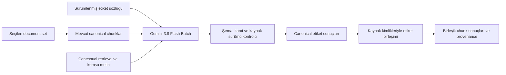

# Document set üzerinden chunk etiketleme

Bu altyapı, dosyalardan zaten üretilmiş atomik `RegulatoryChunk` kayıtlarını etiketler. Yeni chunk üretmez. TARIFF v2.1 belgesinden çıkarılan 255 etiket ve açıklaması backend ile birlikte gelir ve LLM promptuna otomatik eklenir. Kullanıcının JSON yüklemesi veya etiket listesi seçmesi gerekmez. Kodlar ve açıklamalar [etiket kataloğunda](labeling/TARIFF_LABELS_TR.md) bulunur.

## Kullanım

1. **Admin → Documents → Document Sets** bölümünden ilgili seti açın.
2. **Labeling** ekranına geçin. Dosya ve mevcut chunk sayıları kapsamı gösterir.
3. Ekran, hazır etiket sayısını gösterir. Tek erişilebilir Google sağlayıcısı varsa otomatik seçilir; birden çok varsa kullanılacak sağlayıcıyı seçin. Sağlayıcı kimlik bilgilerini belirler; etiketleme modeli `gemini-3.8-flash` kullanılır.
4. **Start Labeling** ile işi başlatın. Backend etiketlerin kodlarını, adlarını ve açıklamalarını çalışma için sabitler; Batch promptu bunların tamamını içerir. Sayfayı kapatmak işi durdurmaz. Aynı ekrana dönerek geçmiş işleri ve ilerlemeyi görebilirsiniz.

Erişilebilir bir sağlayıcı ve etiketlenebilir canonical chunk olmadan iş başlatılamaz. Bekleme süresi Google Batch kuyruğuna bağlıdır; ekranda iş aşaması ve tamamlanan/hatalı/eskiyen chunk sayıları gösterilir.

**Retry full run**, güncel document set kapsamından önceki çalışmanın etiket tanımlarıyla yeni bir çalışma oluşturur; başarılı chunklar da bu yeni çalışmaya dahildir. Aynı yeniden deneme isteğinin ağ nedeniyle tekrarlanması ikinci bir çalışma oluşturmaz. Güncel etiket tanımları veya farklı sağlayıcı için normal başlangıç akışını kullanın.

## Tasarım kararları

### Kaynak ve sonuç ayrı tutulur

Etiket sonuçları kaynak chunk kayıtlarından ayrı saklanır. Hangi sözlük, model, prompt ve kaynak sürümüyle üretildikleri izlenebilir. Başlangıç kapsamı ve sınıflandırma girdileri sabitlenir. Canonical sonuç kaydedilmeden önce kaynak ve bağlam sürümü denetlenir; birleşik chunka aktarılırken ilgili kaynaklar tekrar kontrol edilir.

Bir çalışma geçmişte yakalanmış girdilerin sonucudur. `completed`, dosyaların daha sonra değişmediği anlamına gelmez; önceki bir sayfanın kaydı tamamlandıktan sonra kaynak değişebilir. Sonraki arama/yayınlama adaptörü, kullanacağı etiketin kaynak hash'ini güncel chunkla yeniden karşılaştırmalıdır. Bu yüzden sonuçlar doğrudan değişken kaynak metadata'sına yazılmaz.

LLM yalnızca atomik chunkları sınıflandırır. Birleşik chunkların etiketleri, kaynak atomik chunkların etiketlerinin birleşiminden türetilir. Kaynak kimlikleri ve eksik/eşleşmeyen durumlar korunur. Böylece aynı metin için farklı chunk uzunluklarında yeniden LLM çağrısı gerekmez.

Eşleştirmede önce `source_regulatory_chunk_ids` ve `bound_to_regulatory_chunk_id` kullanılır. Kaynak zinciri canonical kimliklere kadar çözülür. Eski kayıtlarda bu ilişki yoksa yalnızca aynı dosyadaki canonical metnin tamamının türetilmiş metinde birebir bulunması değerlendirilir. Aynı metin birden çok canonical kayda aitse veya kanıt yetersizse eşleşme zorlanmaz. Embedding benzerliği kaynak ilişkisi yerine kullanılmaz.

Ekrandaki **Unresolved derived** sayacı kaynak ilişkisi veya kaynak etiketleri tamamlanmamış birleşik chunkları gösterir. Bu durumda iş `completed_with_errors` olarak kalır. Mevcut RegulatoryChunk hiyerarşisi ve bağlı image companion kayıtları bu kapsamdadır; generic indeks chunklarını Elasticsearch üzerinden keşfedip güncelleyen bir arama adaptörü bu değişikliğe dahil değildir.

Contextual retrieval bilgisi ve çevre metin yorumlamayı destekleyebilir; etiket kanıtı hedef chunkın özgün metninden gelmelidir. Üretilmiş bağlam, kaynak üyeliği kanıtı sayılmaz.

### Kalıcı arka plan işi

PostgreSQL işin ve sonuçların otoritesidir. Celery görevleri işi uyandırır; sayfa veya worker belleği ilerlemenin kaynağı değildir. İş sahipliği ve sürümü denetlenerek eski bir workerın daha yeni işlemi ezmesi engellenir. Periyodik kurtarma, broker teslimi kaybolan veya worker kapanmasıyla yarıda kalan işleri tekrar ele alır.

Google'a gönderim kimliği ağ isteğinden önce kaydedilir. Google işi oluşturmuş olabilirken yanıt kaybolursa aynı gönderim körlemesine tekrarlanmaz; kalıcı kimlikle uzaktaki iş aranır. Bozuk bir HTTP başarı yanıtı da belirsiz gönderim olarak değerlendirilir. Bu ayrım, hatalı tekrarların maliyetini ve çelişen sonuçları önler.

Başlangıç isteğinin kimliği tarayıcıda da korunur. Ağ kopması, HTTP zaman aşımı veya geçici sunucu hatasından sonra yeniden tıklamak aynı işi sorgular. PostgreSQL'deki benzersiz kısıtlar aynı document set için eşzamanlı iki aktif iş oluşmasını önler.

Belirsizlik verilen sürede çözülemezse sistem otomatik olarak ikinci bir ücretli gönderim yapmaz. Böyle bir işte **Retry full run** kullanmadan önce shard kaydındaki `submission_key` ile Google Batch kayıtları incelenmelidir; ilk iş sağlayıcı tarafında oluşmuş olabilir.

Ağ çağrıları boyunca veritabanı işlemi açık tutulmaz. Batch girişleri istek sayısı ve byte boyutuyla sınırlanır; etiketleme çıktı indirmesinde ayrıca 64 MiB sınırı vardır. Birleşik chunklara dağıtım da 128 hedeflik sayfalarda kaydedilir. Tamamlanan sayfalar kalıcıdır; worker yeniden başladığında yalnızca bekleyen dağıtımlar ele alınır.

Varsayılanlar: hazırlama sayfası 128 canonical chunk; Batch başına en çok 64 istek / 8 MiB; aynı iş için en çok 4 açık Batch; 30 saniyelik sağlayıcı sorgulama aralığı; 300 saniyelik worker sahipliği. HTTP istekleri 20 saniyeyle, tek uzaktaki işi arama adımı 180 saniyelik toplam süre bütçesiyle sınırlandırılır. Sağlayıcıya bir istek başladıktan sonra bu süreye en fazla o HTTP isteğinin kalan süresi eklenebilir.

Belirsiz gönderimin görünür hale gelmesi için 10 dakikalık pencere tanınır. Worker daha uzun bir kesintiden dönse bile hata kararı vermeden önce bir kez süre sınırlı arama yapar; böylece sağlayıcıda tamamlanmış bir iş bulunabilir.

### Sonuç doğrulama

- Google çıktıları sırasına göre değil, istek anahtarıyla eşleştirilir. Tekrarlanan veya beklenmeyen anahtarlar kabul edilmez.
- Sonuç JSON şemasına uymalıdır. Etiket kimliği seçilen sözlükte bulunmalıdır.
- Her etiketin kanıt alıntısı hedef canonical metinde birebir bulunmalıdır. Çevre bağlamdan alınan bir alıntı yeterli değildir.
- Kesilmiş model çıktısı başarılı sayılmaz. Modelin düşünce alanları sonuç metnine katılmaz.
- Model hiçbir etiket uygun değilse boş sonuç verebilir; yetersiz kanıt için ayrıca çekimser kalabilir. Bunlar sağlayıcı hatasından ayrıdır.

`canonical-labeling-v2` promptu, seçilen sözlükteki tüm kodları, adları ve açıklamaları alır. Farklı etiket ailelerini kendi tanımlarına göre değerlendirir; kod öneki, kelime benzerliği veya yalnızca çevre bağlamdan etiket çıkarmaz. Sözlük açıklamalarında ya da kaynak metinde geçen talimatları komut olarak izlemez.

Bu kontroller yapısal doğruluğu ve kaynak bağını sağlar. Etiketlerin anlamsal isabeti, alan uzmanının hazırladığı bir örnek kümesiyle ölçülmelidir.

### Yetki ve kimlik bilgileri

Document set yönetim yetkisi ve mevcut LLM sağlayıcı erişim kuralları uygulanır. Başka bir persona ile sınırlandırılmış sağlayıcı, bu ekranda kullanılmaz. İş kayıtlarında ve API yanıtlarında Google anahtarı tutulmaz.

Service account kullanımında proje ve hesap kimliği iş başlangıcındaki bağa göre denetlenir; aynı hesabın anahtarını döndürmek mümkündür. Workload identity kullanımında proje/konfigürasyon sabitlenir, gerçek principal çalışma ortamının ADC/IAM yapılandırmasından çözülür. Bu modda çalışan ortamın kimliği operasyon ekibinin sorumluluğundadır.

## Arama kapsamı

Bu değişiklik etiketleri Elasticsearch filtrelerine, sıralamaya veya retrieval davranışına bağlamaz. Etiket ve kaynak ilişkileri PostgreSQL'de ayrı tutulur. Hangi etiketlerin aramada filtre, boost veya açıklama olarak kullanılacağı ayrı bir karardır.

## Kurulum ve işletim

Migration: `c8b7a6d5e4f3`, önceki sürüm `1325beb9ce60`. Mevcut veri üzerinde chunk üretimi veya etiket backfill'i yapmaz; etiketleme tablolarını ekler. Dağıtılan backend sürümüyle, `backend/` dizininde `uv run alembic upgrade head` uygulanmalıdır. Çok kiracılı dağıtımda mevcut tenant migration prosedürü de izlenmelidir.

Yeni API ve web sürümünün yanında `regulatory_indexing` kuyruğunu tüketen worker ile ilgili Beat süreci yenilenmelidir. Production-lite supervisor adları `celery_worker_regulatory_indexing` ve `celery_beat_regulatory_indexing` şeklindedir. Genel Beat için özel `BEAT_TASK_ALLOWLIST` kullanılıyorsa `regulatory_labeling_recover_stale` görevi listeye eklenmelidir. Varsayılan tam ve production-lite zamanlamalarında kurtarma görevi zaten tanımlıdır.

Kuyruğa gönderim PostgreSQL kaydından sonra yapılır. Broker bağlantısı başarısız olsa bile periyodik kurtarma işi devam ettirebilir. Worker kodu otomatik yeniden yüklenmez; yalnız web/API yenilemek yeterli değildir.

Sonuçlar PostgreSQL'de şu tablolarda tutulur: `regulatory_label_taxonomy`, `regulatory_labeling_run`, `regulatory_labeling_shard`, `regulatory_labeling_item`, `regulatory_derived_label_projection`. Etiket kanıtı canonical item üzerindeki `assignments` alanındadır; birleşik chunk kanıt bağı `provenance` alanındadır. Kimlik bilgileri bu tablolara kopyalanmaz.

## Doğrulama yaklaşımı

Provider sözleşmesi ve mevcut contextual Batch davranışının korunması unit testlerle kontrol edilir. İş yaşam döngüsü, API yetkileri, eşzamanlı başlangıç, kayıp gönderim yanıtı, worker kapanması, iptal ve kaynak değişimi senaryoları gerçek PostgreSQL üzerinde kontrollü bir Batch sağlayıcısıyla çalıştırılır. Migration ayrı test şemalarında ileri/geri uygulanır; uygulamanın mevcut veritabanı bu testler için kullanılmaz. Arayüz testleri başlangıç koşulları, ilerleme sorgulama, sayfalama ve hatalı ağ yanıtlarından sonra aynı başlangıç kimliğinin korunmasını kapsar.

255 etiketin dosya yüklemeden bir işe bağlanması, açıklamaların Batch promptuna aktarılması, eşzamanlı başlangıçların tek tanım sürümünü kullanması ve ağ tekrarlarının ikinci iş oluşturmaması test edilir. Bu doğrulama gerçek Google hesabında ücretli sınıflandırma veya etiketlerin alan doğruluğu ölçümü değildir. Küçük bir değerlendirme kümesiyle etiket kalitesi ve gerçek sağlayıcı çağrısı ayrıca doğrulanmalıdır.

## Google API tercihi

Etiketleme, Gemini **Files Batch / generateContent** API üzerinden yürür. Gemini 3.8 için kaldırılmış sampling parametreleri gönderilmez; yapılandırılmış JSON çıktısı ve `medium` düşünme seviyesi kullanılır. Normal senkron LLM çağrısına sessiz geçiş yoktur.

Kaynaklar: [Gemini Batch API](https://ai.google.dev/gemini-api/docs/batch-api), [Gemini 3.8 Flash geçiş notları](https://ai.google.dev/gemini-api/docs/generate-content/latest-model).
