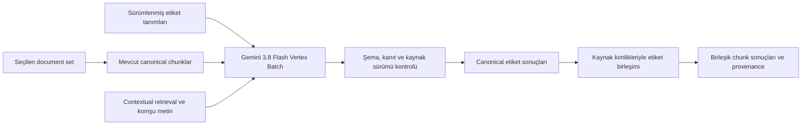

# Document set üzerinden chunk etiketleme

Bu altyapı, dosyalardan zaten üretilmiş atomik `RegulatoryChunk` kayıtlarını etiketler. TARIFF v2.1 belgesinden çıkarılan ilk 255 etiket migration ile PostgreSQL'e kaydedilir. Sonraki ekleme ve düzenlemeler **Label Settings** ekranından yapılır; yeni işin LLM promptu DB'deki güncel etiketleri ve açıklamalarını kullanır. Başlangıç kodları ve açıklamalar [etiket kataloğunda](labeling/TARIFF_LABELS_TR.md) bulunur.

## Kullanım

1. **Admin → Documents → Document Sets** bölümünden ilgili seti açın.
2. **Labeling** ekranına geçin. Dosya ve mevcut chunk sayıları kapsamı gösterir.
3. **Start Labeling** yanındaki **Label Settings** çarkından etiketleri arayın, adlarını ve açıklamalarını düzenleyin, yeni etiket ekleyin veya kaldırın. **Save** değişiklikleri DB'ye kaydeder. Bu ayarlar aynı tenant içindeki tüm document setler için ortaktır ve yeni işleri etkiler.
4. Ekran, güncel etiket sayısını gösterir. Tek erişilebilir Gemini sağlayıcısı varsa otomatik seçilir; birden çok varsa kullanılacak sağlayıcıyı seçin. Sağlayıcı kimlik bilgilerini belirler; etiketleme modeli `gemini-3.8-flash` kullanılır.
5. **Start Labeling** ile işi başlatın. Backend DB'deki etiketlerin kodlarını, adlarını ve açıklamalarını çalışma için sabitler; Batch promptu bunların tamamını içerir. Sayfayı kapatmak işi durdurmaz. Aynı ekrana dönerek geçmiş işleri ve ilerlemeyi görebilirsiniz.

Etiket kimlikleri benzersiz ve kalıcıdır; mevcut etiketlerin adları ve açıklamaları değiştirilebilir. En az 1, en çok 1024 etiket ve toplam 256 KiB tanım sınırı uygulanır. Bir başka yönetici aynı sırada kaydetmişse eski ekranın kaydı reddedilir; güncel tanımlar yeniden yüklenmelidir. Böylece değişiklikler sessizce ezilmez.

Kaydetme, yeni bir değişmez tanım sürümü oluşturup aktif ayarı buna bağlar. Devam eden işler ve **Retry full run**, kendi kayıtlı tanımlarıyla devam eder. Ayarlar değiştikten sonra daha önce kabul edilmiş bir başlangıç isteğinin ağ tekrarı aynı işi döndürür.

Erişilebilir bir sağlayıcı ve etiketlenebilir canonical chunk olmadan iş başlatılamaz. Bekleme süresi Google Batch kuyruğuna bağlıdır; ekranda iş aşaması ve tamamlanan/hatalı/eskiyen chunk sayıları gösterilir.

**Retry full run**, güncel document set kapsamından önceki çalışmanın etiket tanımlarıyla yeni bir çalışma oluşturur; başarılı chunklar da bu yeni çalışmaya dahildir. Aynı yeniden deneme isteğinin ağ nedeniyle tekrarlanması ikinci bir çalışma oluşturmaz. Güncel etiket tanımları veya farklı sağlayıcı için normal başlangıç akışını kullanın.

## Tasarım kararları

### Kaynak ve sonuç ayrı tutulur

Etiket sonuçları kaynak chunk kayıtlarından ayrı saklanır. Hangi etiket tanımı sürümü, model, prompt ve kaynak sürümüyle üretildikleri izlenebilir. Başlangıç kapsamı ve sınıflandırma girdileri sabitlenir. Canonical sonuç kaydedilmeden önce kaynak ve bağlam sürümü denetlenir; birleşik chunka aktarılırken ilgili kaynaklar tekrar kontrol edilir.

Bir çalışma geçmişte yakalanmış girdilerin sonucudur. `completed`, dosyaların daha sonra değişmediği anlamına gelmez; önceki bir sayfanın kaydı tamamlandıktan sonra kaynak değişebilir. Sonraki arama/yayınlama adaptörü, kullanacağı etiketin kaynak hash'ini güncel chunkla yeniden karşılaştırmalıdır. Bu yüzden sonuçlar doğrudan değişken kaynak metadata'sına yazılmaz.

LLM yalnızca atomik chunkları sınıflandırır. Birleşik chunkların etiketleri, kaynak atomik chunkların etiketlerinin birleşiminden türetilir. Kaynak kimlikleri ve eksik/eşleşmeyen durumlar korunur. Böylece aynı metin için farklı chunk uzunluklarında yeniden LLM çağrısı gerekmez.



Eşleştirmede önce `source_regulatory_chunk_ids` ve `bound_to_regulatory_chunk_id` kullanılır. Kaynak zinciri canonical kimliklere kadar çözülür. Eski kayıtlarda bu ilişki yoksa yalnızca aynı dosyadaki canonical metnin tamamının türetilmiş metinde birebir bulunması değerlendirilir. Aynı metin birden çok canonical kayda aitse veya kanıt yetersizse eşleşme zorlanmaz. Embedding benzerliği kaynak ilişkisi yerine kullanılmaz.

Ekrandaki **Unresolved derived** sayacı kaynak ilişkisi veya kaynak etiketleri tamamlanmamış birleşik chunkları gösterir. Bu durumda iş `completed_with_errors` olarak kalır. Mevcut RegulatoryChunk hiyerarşisi ve bağlı image companion kayıtları bu kapsamdadır; generic indeks chunklarını Elasticsearch üzerinden keşfedip güncelleyen bir arama adaptörü bu değişikliğe dahil değildir.

Contextual retrieval bilgisi ve çevre metin yorumlamayı destekleyebilir; etiket kanıtı hedef chunkın özgün metninden gelmelidir. Üretilmiş bağlam, kaynak üyeliği kanıtı sayılmaz.

### Kalıcı arka plan işi

PostgreSQL işin ve sonuçların otoritesidir. Celery görevleri işi uyandırır; sayfa veya worker belleği ilerlemenin kaynağı değildir. İş sahipliği ve sürümü denetlenerek eski bir workerın daha yeni işlemi ezmesi engellenir. Periyodik kurtarma, broker teslimi kaybolan veya worker kapanmasıyla yarıda kalan işleri tekrar ele alır.

Google'a gönderim kimliği ağ isteğinden önce kaydedilir. Google işi oluşturmuş olabilirken yanıt kaybolursa aynı gönderim körlemesine tekrarlanmaz; kalıcı kimlikle uzaktaki iş aranır. Bozuk bir HTTP başarı yanıtı da belirsiz gönderim olarak değerlendirilir. Bu ayrım, hatalı tekrarların maliyetini ve çelişen sonuçları önler.

Başlangıç isteğinin kimliği tarayıcıda da korunur. Ağ kopması, HTTP zaman aşımı veya geçici sunucu hatasından sonra yeniden tıklamak aynı işi sorgular. PostgreSQL'deki benzersiz kısıtlar aynı document set için eşzamanlı iki aktif iş oluşmasını önler.

Belirsizlik verilen sürede çözülemezse sistem otomatik olarak ikinci bir ücretli gönderim yapmaz. Böyle bir işte **Retry full run** kullanmadan önce shard kaydındaki `submission_key` ile Google Batch kayıtları incelenmelidir; ilk iş sağlayıcı tarafında oluşmuş olabilir.

Ağ çağrıları boyunca veritabanı işlemi açık tutulmaz. Batch girişleri istek sayısı ve byte boyutuyla sınırlanır; indirilen sonuçlarda ayrıca toplam 64 MiB sınırı vardır. Birleşik chunklara dağıtım da 128 hedeflik sayfalarda kaydedilir. Tamamlanan sayfalar kalıcıdır; worker yeniden başladığında yalnızca bekleyen dağıtımlar ele alınır.

Varsayılanlar: hazırlama sayfası 128 canonical chunk; Batch başına en çok 64 istek / 8 MiB JSONL; aynı iş için en çok 4 açık Batch; 30 saniyelik sağlayıcı sorgulama aralığı; 300 saniyelik worker sahipliği. Vertex RPC ve GCS isteklerine 20 saniyelik timeout verilir. Kimlik doğrulama yenilemesi ve GCS istemcisinin tekrar deneme bütçesi bundan ayrıdır; bu değer bütün worker adımının toplam süre garantisi değildir.

Belirsiz gönderimin görünür hale gelmesi için 10 dakikalık pencere tanınır. Worker daha uzun bir kesintiden dönse bile hata kararı vermeden önce bir kez süre sınırlı arama yapar; böylece sağlayıcıda tamamlanmış bir iş bulunabilir.

### Sonuç doğrulama

- Google çıktıları sırasına göre değil, istek anahtarıyla eşleştirilir. Tekrarlanan veya beklenmeyen anahtarlar kabul edilmez.
- Sonuç JSON şemasına uymalıdır. Etiket kimliği çalışma için sabitlenen etiket tanımlarında bulunmalıdır.
- Her etiketin kanıt alıntısı hedef canonical metinde birebir bulunmalıdır. Çevre bağlamdan alınan bir alıntı yeterli değildir.
- Kesilmiş model çıktısı başarılı sayılmaz. Modelin düşünce alanları sonuç metnine katılmaz.
- Model hiçbir etiket uygun değilse boş sonuç verebilir; yetersiz kanıt için ayrıca çekimser kalabilir. Bunlar sağlayıcı hatasından ayrıdır.

`canonical-labeling-v2` promptu, çalışma için sabitlenen tüm etiket kodlarını, adlarını ve açıklamalarını alır. Farklı etiket ailelerini kendi tanımlarına göre değerlendirir; kod öneki, kelime benzerliği veya yalnızca çevre bağlamdan etiket çıkarmaz. Etiket açıklamalarında ya da kaynak metinde geçen talimatları komut olarak izlemez.

Bu kontroller yapısal doğruluğu ve kaynak bağını sağlar. Etiketlerin anlamsal isabeti, alan uzmanının hazırladığı bir örnek kümesiyle ölçülmelidir.

### Yetki ve kimlik bilgileri

Document set yönetim yetkisi ve mevcut LLM sağlayıcı erişim kuralları uygulanır. Başka bir persona ile sınırlandırılmış sağlayıcı, bu ekranda kullanılmaz. Etiketleme mevcut Gemini bağlantısındaki Vertex service account veya workload identity kimliğini kullanır; ayrı API anahtarı gerekmez. Kimlik bilgileri iş kayıtlarına kopyalanmaz ve API yanıtlarında geri verilmez.

Sağlayıcı kimliği, proje, konum ve Batch dosya alanı çalışma başlangıcında sabitlenir. Bağlantı değiştiğinde mevcut çalışma sessizce başka bağlantıya geçmez. Başlangıç ön kontrolü Google erişimini veritabanı işleminin dışında kontrol eder; ardından kullanıcı yetkileri ve bağlantı tekrar doğrulanır. Eski Files ve inline işleri kendi kayıtlı taşıma yöntemlerini korur.

## Arama kapsamı

Bu değişiklik etiketleri Elasticsearch filtrelerine, sıralamaya veya retrieval davranışına bağlamaz. Etiket ve kaynak ilişkileri PostgreSQL'de ayrı tutulur. Hangi etiketlerin aramada filtre, boost veya açıklama olarak kullanılacağı ayrı bir karardır.

## Kurulum ve işletim

Migration'lar: `c8b7a6d5e4f3` etiketleme tablolarını, `8d19d521d9fa` güncel etiket ayarını ve ilk 255 tanımı, `9f3a7c2e5d18` ise mevcut LLM sağlayıcı tablosuna nullable ve şifreli Gemini Batch API key alanını ekler. Etiket ayarı migration'ı yalnızca `regulatory_label_settings`, `regulatory_label_taxonomy` ve `regulatory_labeling_run` tablolarını ilgilendirir; Batch anahtarı migration'ı mevcut bağlantılara anahtar değeri yazmaz. Bu migration'lar mevcut chunk, embedding ve indeks verilerini değiştirmez. Dağıtılan backend sürümüyle, `backend/` dizininde `uv run alembic upgrade head` uygulanmalıdır. Çok kiracılı dağıtımda mevcut tenant migration prosedürü de izlenmelidir.

`backend/onyx/regulatory/labeling/data/tariff-regulatory-intelligence-v2.1.json` geçmiş migration'ın sabit başlangıç verisidir; değiştirilmemeli veya silinmemelidir. Migration içindeki hash kontrolü bunu doğrular. Runtime başlangıç ve ayar okuma işlemleri PostgreSQL'i kullanır; dosya değiştirerek kullanıcı düzenlemeleri ezilmez.

13 Eylül 2026'da `customs-regulations-test/public` üzerinde yalnızca `regulatory_label_taxonomy` ve `regulatory_label_settings` tabloları oluşturulup 255 başlangıç etiketi kaydedildi; kod, ad ve açıklamalar birebir doğrulandı. Mevcut `alembic_version` (`f4a9c2d7e1b3`) ilerletilmedi ve bekleyen genel migration'lar çalıştırılmadı. İş tabloları ve yeni API/web sürümünün dağıtımı bu başlangıç kaydından ayrıdır. İlgili iki migration, önceden oluşturulmuş bu tabloların yapısını doğrular ve mevcut etiket düzenlemelerini korur; uyumsuz bir tabloyu sessizce kabul etmez. Bu işlemde mevcut chunklar, embeddingler ve Elasticsearch verileri değiştirilmedi.

Bu sürümün dağıtım hedefi yalnızca DEV ortamıdır (`customs-regulations-dev`). Yukarıdaki `customs-regulations-test/public` kaydı geçmişte yapılan sınırlı başlangıç işlemini belgeler; DEV migration ve uygulama dağıtımından farklıdır. Production bu dağıtım adımının hedefi değildir.

Yeni API ve web sürümünün yanında `regulatory_indexing` kuyruğunu tüketen worker ile ilgili Beat süreci yenilenmelidir. Production-lite supervisor adları `celery_worker_regulatory_indexing` ve `celery_beat_regulatory_indexing` şeklindedir. Genel Beat için özel `BEAT_TASK_ALLOWLIST` kullanılıyorsa `regulatory_labeling_recover_stale` görevi listeye eklenmelidir. Varsayılan tam ve production-lite zamanlamalarında kurtarma görevi zaten tanımlıdır.

Kuyruğa gönderim PostgreSQL kaydından sonra yapılır. Broker bağlantısı başarısız olsa bile periyodik kurtarma işi devam ettirebilir. Worker kodu otomatik yeniden yüklenmez; yalnız web/API yenilemek yeterli değildir.

Sonuçlar PostgreSQL'de şu tablolarda tutulur: `regulatory_label_taxonomy`, `regulatory_labeling_run`, `regulatory_labeling_shard`, `regulatory_labeling_item`, `regulatory_derived_label_projection`. Güncel tanım sürümünü, düzenleme revision'ını, zamanı ve düzenleyeni `regulatory_label_settings` tutar. Etiket kanıtı canonical item üzerindeki `assignments` alanındadır; birleşik chunk kanıt bağı `provenance` alanındadır. Kimlik bilgileri bu tablolara kopyalanmaz.

## Doğrulama yaklaşımı

Provider sözleşmesi ve mevcut contextual Batch davranışının korunması unit testlerle kontrol edilir. İş yaşam döngüsü, API yetkileri, eşzamanlı başlangıç, kayıp gönderim yanıtı, worker kapanması, iptal ve kaynak değişimi senaryoları gerçek PostgreSQL üzerinde kontrollü bir Batch sağlayıcısıyla çalıştırılır. Migration ayrı test şemalarında ileri/geri uygulanır; uygulamanın mevcut veritabanı bu testler için kullanılmaz. Arayüz testleri başlangıç koşulları, ilerleme sorgulama, sayfalama ve hatalı ağ yanıtlarından sonra aynı başlangıç kimliğinin korunmasını kapsar.

255 etiketin dosya yüklemeden bir işe bağlanması, açıklamaların Batch promptuna aktarılması, eşzamanlı başlangıçların tek tanım sürümünü kullanması ve ağ tekrarlarının ikinci iş oluşturmaması test edilir. Bu doğrulama gerçek Google hesabında ücretli sınıflandırma veya etiketlerin alan doğruluğu ölçümü değildir. Küçük bir değerlendirme kümesiyle etiket kalitesi ve gerçek sağlayıcı çağrısı ayrıca doğrulanmalıdır.

## Google API tercihi

Yeni etiketleme işleri Vertex'in **BatchPredictionJob** akışını kullanır. Uygulama bu akışın Cloud Storage üzerinden JSONL giriş ve sonuç dosyası yöntemini uygular. Kullanıcı dosya yüklemez veya sonuç indirme komutu çalıştırmaz: worker JSONL girdisini gönderir, işi takip eder ve sonuçları otomatik indirip PostgreSQL'e kaydeder. Tam prompt, sistem talimatı ve JSON şeması her istekte korunur. Gemini 3.8 için kaldırılmış sampling parametreleri gönderilmez; yapılandırılmış JSON çıktısı ve `medium` düşünme seviyesi kullanılır. Normal senkron LLM çağrısına sessiz geçiş yoktur.

API ve worker aynı `REGULATORY_LABELING_VERTEX_GCS_URI=gs://bucket/prefix` değerini kullanmalıdır. DEV iş akışı bu değeri `REGULATORY_LABELING_VERTEX_GCS_URI_DEV` repository variable üzerinden alır. Yalnızca etiketleme için ayrılmış özel bir alan kullanılmalıdır. İstek, korelasyon manifesti ve sonuçlar bu alanın `labeling/<submission_hash>/` altına yazılır; gateway bunun dışındaki nesneleri sonuç olarak kabul etmez.

Uygulama servis hesabının bu alanda nesne oluşturma, okuma ve listeleme; Vertex'in Google tarafından yönetilen service agent'ının giriş okuma ve çıktı yazma yetkisi olmalıdır. Sonuçlar PostgreSQL'e kalıcı olarak aktarılsa da mevcut worker GCS nesnelerini anında silmez. Geçici dosyaların saklama süresi, yalnızca bu işe ayrılmış bucket veya prefix için tanımlanan yaşam döngüsü kuralıyla yönetilmelidir; mevcut belge/embedding alanlarının politikaları değiştirilmemelidir.

Kaynaklar: [Vertex Batch ve Cloud Storage](https://docs.cloud.google.com/vertex-ai/generative-ai/docs/multimodal/batch-prediction-from-cloud-storage), [Google kimlik doğrulama](https://docs.cloud.google.com/vertex-ai/generative-ai/docs/start/gcp-auth), [Gemini 3.8 Flash geçiş notları](https://ai.google.dev/gemini-api/docs/generate-content/latest-model).

## DEV ortamında bucket hazır olduğunda

Altyapı ekibi özel GCS alanını ve uygulama servis hesabı ile Vertex service agent erişimlerini hazırladıktan sonra, verilen `gs://bucket/prefix` yolu `REGULATORY_LABELING_VERTEX_GCS_URI_DEV` repository variable değerine yazılır. Bu değer bir API anahtarı değildir. Kodda bucket adı veya yeni servis hesabı tanımlanmaz.

```sh
gh variable set REGULATORY_LABELING_VERTEX_GCS_URI_DEV \
  --repo atezsoftware/customs-regulations-chatbot \
  --body 'gs://BUCKET/PREFIX'
```

Değişkeni kaydetmek çalışan podları güncellemez. Standart DEV iş akışının `annex-activate` eylemi, son başarılı backend ve web deploylarının tam commit SHA'sıyla çalıştırılır. Aynı imaj kullanılarak API ve background ayarları birlikte uygulanır; yeni kod build'i gerekmez. Başka bir SHA veya elle capability/gate değişikliği kullanılmaz.

```sh
gh workflow run customs-regulations-backend-lite-codebuild.yaml \
  --repo atezsoftware/customs-regulations-chatbot --ref develop \
  -f environment=dev -f action=annex-activate \
  -f image_tag=FULL_DEPLOYED_COMMIT_SHA
```

Aktivasyon başarılı olduktan sonra Labeling ekranı yenilenir. Storage yapılandırma hatasının kaybolması yalnızca yapılandırmanın yüklendiğini gösterir. **Start Labeling** model, Batch listeleme ve GCS listeleme erişimlerini kontrol eder; gerçek oluşturma/yazma yetkisi ve sonuç toplama ancak küçük, ayrılmış bir document set üzerindeki uçtan uca Batch denemesiyle doğrulanır. Büyük belge seti bağlantı testi olarak kullanılmaz.

Bu adımda normal indekslemenin Batch bayrağı, embedding ayarları ve mevcut indeksler değiştirilmez. Bucket yolu olmadan sürüm açılabilir ve etiketler düzenlenebilir; yeni etiketleme işi açıklayıcı yapılandırma hatasıyla engellenir. İzinler ve bucket yolu sağlanmadan canlı Vertex Batch başarısı doğrulanmış sayılmaz.
