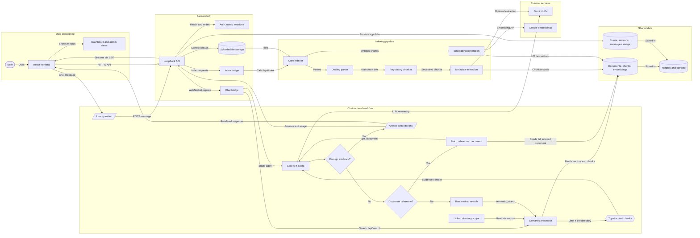

# Project workflow diagram

This diagram explains the project as two connected flows:

- Indexing flow: uploaded files are parsed, chunked, embedded, and stored in Postgres with pgvector.
- Chat flow: a user question first searches linked directories, sends the highest scoring chunks to the agent, and then iterates with additional search or document fetches when evidence is not enough.

## Notes

- The backend scopes every chat to explicitly linked directories before search.
- The first retrieval pass sends the highest scoring chunk hits into the agent context.
- If the agent cannot answer from that context, it can call another indexed search.
- If the answer path mentions a specific document reference, the agent can fetch that document through `get_document`.
- Final answers are stored with messages, sources, research steps, and LLM usage.
