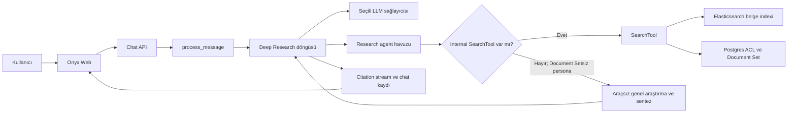
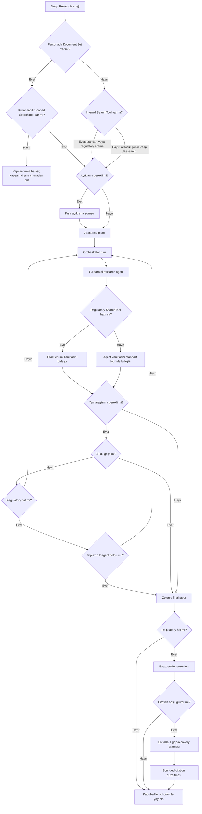

# Deep Research Workflow

Bu belge, chat ekranında **Deep Research** açıkken çalışan gerçek backend
akışını anlatır. Diyagramlar `backend/onyx/chat/process_message.py`,
`backend/onyx/deep_research/dr_loop.py`,
`backend/onyx/tools/fake_tools/research_agent.py` ve
`backend/onyx/chat/staged_generation.py` içindeki kontrol yoluyla hizalıdır.

## Sistem görünümü



Model, admin varsayılanından bağımsız bir ikinci yol üzerinden seçilmez.
Normal chat hattının çözdüğü istek/session `LLMOverride` değeri aynı model
nesnesi olarak Deep Research döngüsüne girer.

## İstekten rapora sıralı akış

```mermaid
sequenceDiagram
    actor User as Kullanıcı
    participant Web as Web UI
    participant Chat as process_message
    participant DR as Deep Research
    participant LLM as Seçili LLM
    participant Search as SearchTool
    participant Index as Elasticsearch

    User->>Web: Sorgu ve Deep Research seçimi
    Web->>Chat: Persona, model override ve filtreler
    Chat->>Chat: Modeli ve persona araçlarını çöz
    alt Personada Document Set var
        Chat->>Chat: Kullanılabilir scoped SearchTool zorunluluğunu doğrula
        Chat->>DR: Aynı model ve scoped SearchTool ile başlat
    else Personada Document Set yok
        Chat->>DR: Aynı modelle; varsa internal SearchTool, yoksa araçsız başlat
    end
    DR->>LLM: Gerekirse açıklama sorusu ve araştırma planı
    loop Araştırma turları
        DR->>LLM: Alt araştırma görevlerini üret
        opt Internal SearchTool mevcut
            DR->>Search: En fazla 3 paralel agent ile ara
            Search->>Index: ACL ve varsa Document Set filtreli retrieval
            Index-->>Search: Exact document_id ve chunk_ind
            Search-->>DR: Kanıt, heading path ve citation
        end
    end
    DR->>LLM: Araştırma sonuçlarına dayalı taslak rapor
    alt Regulatory SearchTool hattı
        DR->>DR: Exact evidence ve citation-gap kontrolü
    else Genel Deep Research hattı
        DR->>DR: Standart citation eşlemesi
    end
    DR-->>Chat: Final metin ve varsa kabul edilen citationlar
    Chat-->>Web: Tokenlar, adımlar, citations ve tamamlanma
    Web-->>User: Rapor ve varsa exact chunk bağlantıları
```

## Orchestrator karar döngüsü



## Scope ve güvenlik sınırları

| Sınır | Uygulanan davranış |
| --- | --- |
| Model | Chat isteği veya session override, sonra persona/default sırası |
| Araçlar | Deep Research'e araç aktarılacaksa yalnız internal `SearchTool` aktarılır; Document Setsiz persona sıfır araçla da genel akışa devam edebilir |
| Document Set | Personada set varsa kullanılabilir `SearchTool` zorunludur; persona seti üst sınırdır ve istek filtresi yalnız kesişimle daraltır. Set yoksa bu zorunluluk uygulanmaz |
| Yetki | Retrieval, kullanıcı ACL filtreleriyle birlikte çalışır |
| Paralellik | Aynı anda en fazla 3 research agent |
| Toplam iş | Regulatory hatta en fazla 12 research agent; genel hatta bu toplam sayaç uygulanmaz |
| Süre | Orchestrator 30 dakikadan sonra yeni tur başlatmaz; 29. dakikada başlayan agent kendi 30 dakikalık timeout'una kadar çalışabilir |
| Agent raporu | Her agent için 12. dakikada ara rapor zorlanır; agent başına mutlak timeout 30 dakikadır |
| Kanıt kimliği | `document_id + chunk_ind`; heading path sunum bilgisidir |
| Regulatory yayın | Exact-evidence review, tek gap-recovery ve bounded correction sonrası kabul edilen chunks yayınlanır |
| Genel yayın | Standart Deep Research citation mapping kullanılır; regulatory evidence/gap katmanı çalışmaz |

## Citation yaşam döngüsü

Search kullanan research agent sonuçları önce kendi yerel citation alanında
oluşur ve orchestrator bunları tek global numaralandırmaya taşır. Araçsız genel
akış kanıt/citation üretmek zorunda olmadan model yanıtlarını sentezleyebilir.
Regulatory SearchTool hattında ayrıca exact-evidence review eksik veya kanıtsız
atıfları kontrol eder; gerekirse yalnız bir gap-recovery araması ve sınırlı
correction çalışır. Genel Deep Research bu regulatory katmana girmez ve standart
citation mapping ile devam eder. Her iki hat da sonucu `staged_generation`
üzerinden yayınlar. Chat kaydı exact chunk kimliğini saklar; frontend etiketi
heading path'ten okunur ve tıklama tam dosya yerine yalnız ilgili chunk'ı
getirir.

## Operasyonel gözlem noktaları

- Chat dispatch ve model çözümü: `backend/onyx/chat/process_message.py`
- Plan, orchestrator, limitler ve final review:
  `backend/onyx/deep_research/dr_loop.py`
- Paralel arama, SearchTool forkları ve evidence birleştirme:
  `backend/onyx/tools/fake_tools/research_agent.py`
- Kabul edilmiş citationların commit edilmesi:
  `backend/onyx/chat/staged_generation.py`
- İstek sırasında backend logları: `backend/log/api_server_debug.log`
- Arka plan işleri: `backend/log/celery_*_debug.log`
