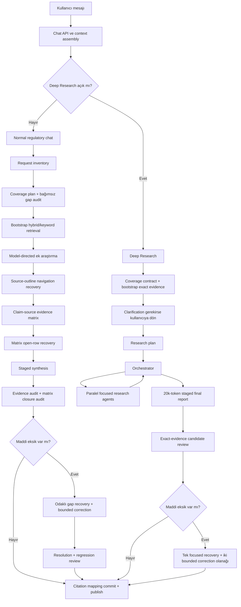
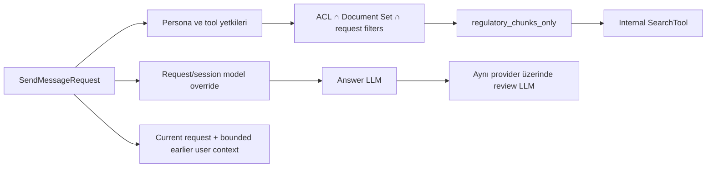
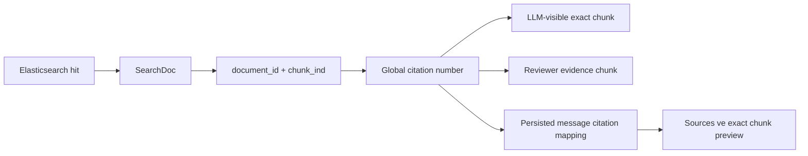

# Regulatory Chat ve Deep Research Workflow

Bu belge, Onyx'in ortak düzenleyici doküman korpusu üzerinde çalışan iki kullanıcı
akışını kaynak kodla hizalı olarak açıklar:

1. normal chat içinde kullanılan düzenleyici araştırma ve cevap denetimi;
2. kullanıcı **Deep Research** seçtiğinde çalışan daha yüksek bütçeli planlama,
   araştırma-agent ve final rapor akışı.

Belgenin amacı yalnızca kutu isimlerini sıralamak değildir. Her aşamada hangi
verinin üretildiğini, hangi veriyle karar verildiğini, hangi LLM veya arama
çağrısının yapıldığını, citation kimliğinin nasıl korunduğunu ve hata halinde
hangi güvenli yolun izlendiğini gösterir.

> Promptlar ve Python kaynak kodu çalışma davranışının tek doğruluk kaynağıdır.
> Bu belge mimari sözleşmeyi ve mevcut sayısal sınırları açıklar; promptların
> tamamını kopyalamaz.

## 1. Kapsam ve temel ilkeler

Bu workflow yalnızca `regulatory_chunks_only=true` olan internal `SearchTool`
hattında etkinleşir. Production'da varsayılan persona ile açılan normal chat ve
aynı persona üzerinde seçilen Deep Research bu filtreyi taşımalıdır. Özel
personalar kendi Document Set, ACL ve tool kapsamlarını korur.

Ortak ilkeler:

- Araştırma kapsamı güncel kullanıcı isteğinden çıkarılır; benchmark soruları,
  beklenen cevaplar, judge rubric'i veya önceki örneklerden öğrenilmiş hukuki
  konu listeleri promptlara aktarılmaz.
- Request inventory, coverage plan ve evidence matrix hukuki kanıt değildir.
  Bunlar eksik cevap vermeyi önleyen advisory kontrol verileridir.
- Bir heading, belge adı, madde numarası, search hit sayısı veya komşu hüküm tek
  başına claim desteği sayılmaz. Sonuç exact chunk metniyle doğrulanır.
- Citation kimliği akış boyunca `(document_id, chunk_ind)` ile korunur. Aynı
  citation numarası başka bir chunk'a yeniden atanamaz.
- Arama sayısı sabit bir hedef değildir. Açık kalan request-derived önerme yeni
  ve anlamlı bir arama gerektiriyorsa araştırma devam eder; kanıt yeterliyse
  bütçeyi tüketmek için arama yapılmaz.
- İnceleme modeli, cevap modelinin provider ve credential rotasını kullanır.
  `REGULATORY_REVIEW_MODEL` yalnızca aynı provider içindeki model katmanını
  değiştirebilir.
- Kullanıcıya yalnız staged candidate denetimden geçtikten sonra stream edilir.
  Reddedilmiş ara taslak kullanıcıya veya kalıcı chat kaydına sızmaz.

## 2. Üst seviye akış

Normal chat daha düşük kullanıcı gecikmesiyle request closure ve citation
doğruluğuna odaklanır. Deep Research, yüksek token maliyetini plan,
orchestrator ve focused sub-agent araştırmalarına harcar. İki dal aynı exact
chunk citation ve unsupported-claim güvenlik sınırını paylaşır; iç kontrol
adımları birebir aynı değildir.

## 3. Ortak giriş: context, model ve arama kapsamı

Kaynaklar:

- `backend/onyx/chat/process_message.py`
- `backend/onyx/chat/llm_loop.py`
- `backend/onyx/deep_research/dr_loop.py`
- `backend/onyx/tools/tool_implementations/search/search_tool.py`

Varsayılan regulatory chat davranışı:

1. Varsayılan persona SearchTool'u otomatik alır; FileReader global regulatory
   chatten çıkarılır. Böylece tüm dosyayı bypass ederek okuyan ayrı bir kanal
   oluşmaz.
2. Kapsam user-file regulatory chunk korpusudur. `as_of_date` verilmemişse
   bugünün tarihi kullanılır; yürürlük penceresi olan chunklar buna göre
   filtrelenir.
3. User request yalnız current turn'den alınır. Önceki user mesajları en fazla
   beş mesaj ve bounded karakter bütçesiyle yalnız referans çözümü için taşınır;
   yeni deliverable oluşturmaz.
4. Answer LLM normal chat model seçiminden gelir. Review LLM için
   `REGULATORY_REVIEW_MODEL` varsa aynı provider/config üzerinde temperature 0
   ile ikinci model oluşturulur; yoksa answer LLM kullanılır.
5. Tool, prompt ve kullanıcı içeriği untrusted data sınırlarıyla ayrılır.

## 4. Normal chat workflow

### N0 — Regulatory hattın etkinleşmesi

`run_llm_loop`, tool listesinde `regulatory_chunks_only=true` filtreli bir
`SearchTool` gördüğünde gelişmiş akışı açar. Doğrudan, aramasız sohbet cevapları
eski incremental stream davranışını korur. SearchTool kullanıldığı anda cevap
staged moda geçer ve denetim tamamlanana kadar kullanıcıya yayınlanmaz.

Normal chat taban cycle bütçesi `MAX_LLM_CYCLES` ile gelir ve varsayılanı 6'dır.
Regulatory akış buna aşağıdaki iç cycle alanlarını ekler:

- 1 bootstrap coverage cycle;
- 1 autonomous research cycle;
- 1 projected-stop synthesis cycle;
- ilk review reddinden sonra en fazla 3 correction/research cycle.

Bu ekler sabit sayıda arama zorlamaz. Yalnız server-orchestrated adımların normal
Onyx cycle bütçesini yanlışlıkla tüketmesini engeller.

### N1 — Request inventory

Kaynaklar:

- `backend/onyx/prompts/regulatory_coverage_plan.py`
- `backend/onyx/regulatory/coverage_plan.py`

İlk structured çağrı yalnız kullanıcı isteğini atomik cevap yükümlülüklerine
ayırır. Bir numaralı madde veya uzun cümle tek obligation sayılmak zorunda
değildir; bağımsız cevaplanabilen koordineli çıktılar ayrılır. Aliaslar,
betimleyici facts ve tek sonucu adlandıran kelimeler yapay biçimde bölünmez.

Çıktıdaki her obligation:

- `O1`, `O2`, ... şeklinde stabil ID;
- kaynak request segment ID'leri;
- kullanıcı metninden birebir alınmış kısa anchorlar;
- yalnız kullanıcı açıkça verdiyse source anchor içerir.

Sınırlar:

| Alan | Sınır |
| --- | ---: |
| User request | 24.000 karakter |
| Request outline segment | 12 |
| Inventory obligation | 20 |
| Inventory output | 12.000 token |
| Structured deneme | geçersiz schema için en fazla 2 |

Inventory çağrısı başarısız olursa syntax tabanlı request outline korunur;
workflow tüm planı kaybetmez.

### N2 — Coverage plan ve bağımsız coverage audit

İkinci structured çağrı inventory'yi retrieval contract'a dönüştürür. Her
coverage item şunları içerir:

- request segment ve obligation ID bağlantıları;
- bağımsız `evidence_dimensions`;
- her dimension için birebir `retrieval_queries`;
- requestte açıkça bulunan factual branchler;
- item'ın kapanma koşulunu anlatan `completion_test`.

Plan, yaygın hukuki konu listesi veya olası cevaptan yeni satır türetemez.
Requestte bulunmayan predicted source, outcome, değer, exception veya madde adı
eklenemez.

Üçüncü structured çağrı planı bağımsız olarak denetler. Denetçi yalnız yapısal
closure kontrol eder:

- her request segment gerçekten bir item'a bağlı mı;
- her inventory obligation korunmuş mu;
- requestteki karşılaştırmalı durumlar ayrık mı;
- bağımsız çıktılar tek opaque dimension içinde kaybolmuş mu;
- dimension ve query birebir mi;
- source anchor gerçekten kullanıcıdan mı geliyor.

Audit yalnız eksik request-grounded item'ları döndürür ve ana planla deduplicate
edilerek birleşir. Ardından server, LLM çıktısından bağımsız deterministic
coverage kontrolü yapar; map edilmemiş segment veya obligation için bounded
fallback item ekler.

| Alan | Sınır |
| --- | ---: |
| Coverage item | 20 |
| Item başına evidence dimension | 6 |
| Item başına factual branch | 6 |
| Coverage plan output | 12.000 token |
| Coverage gap audit output | 12.000 token |

### N3 — Bootstrap retrieval

Coverage item'lar doğrudan SearchTool çağrılarına çevrilir. Her atomic evidence
dimension için önce hybrid arama planlanır; kalan kapasite farklı lexical erişim
sağlamak üzere keyword fallbacklere dağıtılır.

Temel sınırlar:

- bir batch'te en fazla 32 search call;
- aynı anda en fazla 8 SearchTool execution;
- call başına LLM'e en fazla 10 regulatory chunk;
- duplicate `(normalized query, search_mode)` tekrarları çalıştırılmaz;
- query expansion server-orchestrated focused sorgularda kapatılabilir;
- coverage item, evidence target ve source anchorlar tool provenance olarak
  saklanır.

SearchTool aşağıdaki retrieval katmanlarını korur:

1. request-native lexical sinyaller;
2. configured embedding/vector retrieval;
3. keyword ve hybrid lane sonuçları;
4. PostgreSQL regulatory chunk görünürlük doğrulaması;
5. heading/provision family structural expansion;
6. parent, child ve sibling bağlamıyla kısa veya grammatically incomplete
   chunk'ın tamamlanması;
7. mode-sensitive deduplication ve final ranking;
8. exact `document_id + chunk_ind` citation mapping.

### N4 — Autonomous research kararı

Bootstrap bitince answering model en az bir normal Onyx araştırma kararı alma
fırsatını korur. Model:

- eldeki kanıtın açık coverage row'larını kapatıp kapatmadığını inceler;
- yeni bir focused query ve `hybrid`/`keyword` mode seçebilir;
- materially different arama yoksa research complete kararı verir.

Bu aşama server planının modele sabit bir checklist dayatmasını önler. Coverage
contract eksiklik kontrolü sağlar; araştırma stratejisinin sahibi answering
modeldir.

### N5 — Source-outline navigation recovery

Search sonuçlarında operative text yerine heading, cross-reference veya komşu
hüküm görünmüş olabilir. Bunlar kanıt olarak kullanılmaz; metadata-only
navigation lead olarak biriktirilir.

Bağımsız navigation selector:

- current request, coverage contract ve yalnız sağlanan leadleri görür;
- en fazla 256 lead değerlendirir;
- distinct açık obligationları redundant headinglerden önce kapsar;
- en fazla 16 navigation ID seçer;
- yeni ID, source veya hukuki konu üretemez.

Seçilen headingler `document title + heading label` focused hybrid sorgusuyla
yeniden alınır. Ancak getirilen exact text kanıt olabilir; selector kararı veya
headingin kendisi kanıt değildir.

### N6 — Claim-source evidence matrix

Kaynaklar:

- `backend/onyx/prompts/regulatory_evidence_matrix.py`
- `backend/onyx/regulatory/evidence_matrix.py`

Navigation tamamlandıktan sonra exact evidence, araştırma provenance'ıyla
birlikte structured matrix çağrısına verilir. Matrix'in her satırı:

- request-derived `target`;
- ilgili `T` research target ID'leri;
- `supported`, `partial`, `missing` veya `conflicting` status;
- exact textten daha geniş olmayan `supported_proposition`;
- yalnız gerçekten mevcut evidence document numaraları;
- açık kalan `missing_aspects`;
- gerekiyorsa tek focused `recovery_query` taşır.

Server aşağıdaki hard validationları uygular:

- payloadta bulunmayan document numarası atılır;
- evidence olmadan `supported` veya `conflicting` dönen satır `missing` olur;
- supported satır recovery query taşıyamaz;
- duplicate rowlar birleşir;
- matrix retrieval targetı yeni kullanıcı deliverable'ına çeviremez.

| Alan | Sınır |
| --- | ---: |
| Matrix evidence chunk | 320 |
| Toplam exact evidence | 260.000 karakter |
| Chunk başına evidence | 3.000 karakter |
| Matrix row | 64 |
| Row başına document number | 12 |
| Matrix output | 24.000 token |

### N7 — Matrix open-row recovery

İlk matrixte `partial`, `missing` veya `conflicting` kalan ve focused query
taşıyan satırlar bir defa recovery batch'ine çevrilir. En fazla 32 deduplicated
query normal SearchTool üzerinden çalışır. Yeni exact chunks toplandıktan sonra
matrix yalnız açık satırlar için yeniden değerlendirilir; daha önce supported
satırlar gereksiz yere baştan üretilmez.

Bu pass yalnız mevcut request-grounded satırı kapatabilir. Yeni konu ekleyemez ve
başarılı aramaları mekanik doğrulama için tekrar etmez.

### N8 — Dynamic stop ve full-evidence synthesis

Araştırma geçmişi büyüdüğünde modelin tool kararı için bütün chunk metinlerini
tekrar tekrar göndermek pahalıdır. 32'den fazla geçerli result sonrasında server
bounded bir karar görünümü oluşturabilir:

- her search için query, mode ve result receipt;
- en öncelikli evidence excerptleri;
- coverage ve matrix özeti;
- navigation heading envanteri;
- candidate review issue'ları.

Bu projection yalnız “başka arama gerekli mi?” kararı içindir. Projectiondan
üretilen prose kullanıcıya yayınlanmaz. Model research complete derse bir sonraki
cycle tools kapalı biçimde, seçilmiş full exact evidence ile isolated synthesis
yapar.

Synthesis selection:

- cited chunks;
- evidence-matrix documentları;
- review issue citationları;
- research target başına temsili exact evidence;
- coverage item başına dengeli evidence

önceliğiyle hazırlanır. Soft limit 96 evidence chunk'tır; bu limit source
çeşitliliğini koruyacak biçimde uygulanır.

### N9 — Staged candidate

Model tools kapalıyken current request, bounded earlier context, coverage
contract, claim-source matrix ve seçilmiş exact evidence üzerinden final adayı
üretir. Regulatory synthesis sırasında reasoning effort `OFF` kullanılır;
tool-decision çağrılarında görünür çıktı için 1.536 token ve seçilen reasoning
effort için ayrı reserve uygulanır.

Candidate answer doğrudan stream edilmez. `BufferedEmitter`, ayrı
`ChatStateContainer` ve fork edilmiş citation processor içinde tutulur.

### N10 — Üç katmanlı answer denetimi

İlk candidate üzerinde birbirini tamamlayan kontroller çalışır:

1. **Evidence ve request-closure audit:** Her express deliverable cevaplanmış mı;
   her material claim exact chunk tarafından doğrudan destekleniyor mu?
2. **Deterministic matrix citation check:** Supported matrix row cevaba taşınmış
   mı ve matrixteki exact documentlardan biriyle cite edilmiş mi?
3. **Focused matrix-closure LLM audit:** Matrix satırı yanlış biçimde unsupported
   denmiş, eksik uygulanmış veya başka satırdaki citation ile kapatılmış mı?

Issue'lar claim span, claim kind, advisory feedback, related citation numbers ve
opsiyonel focused recovery query taşır. Tek audit en fazla 16 deduplicated issue
döndürür.

Review input sınırları:

| Alan | Sınır |
| --- | ---: |
| Candidate | 36.000 karakter |
| Exact evidence chunk | 256 |
| Toplam exact evidence | 200.000 karakter |
| Evidence matrix | 100.000 karakter |
| Review output | en fazla 24.000 token |
| Resolution output | en fazla 16.000 token |

Independent review model çağrısı unavailable olursa aynı audit answering model
ile bir kez tekrar edilir. Her iki çağrı da unavailable ise normal chat
fail-open davranışını korur ve review error loglanır.

### N11 — Batched gap recovery ve correction

İlk review maddi issue bulursa en fazla beş query-distinct recovery issue seçilir.
Öncelik sırası:

1. legal-rule issue;
2. candidate içindeki exact span;
3. span'ın cevap içindeki konumu;
4. review issue sırası.

Her query ayrı focused hybrid SearchTool çağrısıdır; sonuçlar tek response ve tek
global citation namespace içinde birleştirilir. Query expansion kapalıdır.
Recovery yalnız reviewün current request ve mevcut evidence dilinden ürettiği
query'yi çalıştırır.

Candidate daha sonra bounded correction cycle'ına girer. İkinci review:

- önceki tüm issue'ların resolution durumunu kontrol eder;
- bağımsız evidence auditini yeniden çalıştırır;
- matrix citation ve closure kontrolünü tekrarlar;
- yeni grounding regression oluşmuşsa önceki issue'larla birleştirir.

Normal chatte en fazla iki candidate review pass vardır. İkinci pass sonrasında
server yeni sınırsız rewrite döngüsü açmaz; kalan issue'ları warning ile kaydeder
ve son reviewed candidate'ı yayınlar.

### N12 — Commit, stream ve persist

Candidate kabul edildiğinde staged state atomik biçimde ana state'e alınır:

- answer tokenları stream edilir;
- yalnız emitted citationlar final document listesine girer;
- citation number → `(document_id, chunk_ind)` mapping kalıcı mesaja yazılır;
- Sources paneli ve citation preview aynı exact chunk'ı kullanır;
- rejected taslakların answer/citation state'i kalıcı kayda girmez.

## 5. Deep Research workflow

Deep Research normal chatin yalnız “daha fazla cycle” seçeneği değildir. Ayrı
plan, orchestrator, focused research-agent ve final-report zinciridir. Aynı
regulatory SearchTool, coverage contract, exact evidence ve candidate review
güvenlik sınırlarını kullanır; normal chatteki structured navigation selector ve
claim-source `RegulatoryEvidenceMatrix` şu anda Deep Research orchestrator
zincirinin ayrı bir aşaması değildir.

### D0 — Başlangıç koşulları

- Seçili model en az 50.000 input token desteklemelidir.
- Tool allowlist yalnız internal SearchTool'dur; web veya bütün global tool
  registry otomatik miras alınmaz.
- Varsayılan regulatory persona aynı `regulatory_chunks_only=true` kapsamını
  kullanır.
- Aynı answer LLM plan, orchestrator, research agent ve final report için
  korunur; optional review model yalnız denetim çağrılarında kullanılır.

### D1 — Coverage contract ve bootstrap exact evidence

Normal chatteki request inventory, coverage plan ve gap audit aynen çalışır.
Coverage dimensionları SearchTool çağrılarına çevrilir; call'lar dörderli
batchlerde yürütülür, call başına en fazla 6 chunk alınır ve toplam en fazla 48
exact evidence chunk bootstrap envanterine taşınır.

Bu evidence, dense ve contiguous citation namespace'e normalize edilerek
history'ye “retrieved exact evidence” reminder'ı olarak eklenir. Bu bir
claim-source verdict değildir; araştırmanın eksik veya indirect rowları kapatması
gerektiğini açıkça söyler.

### D2 — Clarification

Clarification kapatılmamışsa model current requesti değerlendirir:

- yeterince açıksa yalnız `generate_plan({})` tool call üretir;
- maddi belirsizlik varsa aynı dilde en fazla beş soru sorar ve turn burada
  kapanır.

Regulatory clarification görünür output sınırı 1.024 token'dır.

### D3 — Research plan

Plan LLM'i yalnız numaralı araştırma adımları üretir. Request-derived maddi
önermeleri ayırır; sabit bir adım sayısına ulaşmak için yeni konu eklemez.
Regulatory plan output sınırı 2.048 token'dır.

### D4 — Orchestrator

Orchestrator yalnız tool call üretebilir:

- `research_agent(task)`;
- normal modelde gerektiğinde `think_tool(reasoning)`;
- `generate_report({})`.

Sınırlar:

- normal modelde en fazla 8 orchestrator cycle;
- native reasoning modelde en fazla 4 cycle;
- aynı anda en fazla 3 research agent;
- turn boyunca en fazla 12 research agent;
- task uzunluğu en fazla 1.200 karakter;
- agent yalnız kendi focused task'ini görür, global query ve diğer agent
  history'sini otomatik görmez.

Orchestrator planı bitirdiği için değil, material request rows için kanıt yeterli
olduğu veya farklı yararlı araştırma kalmadığı için final rapora geçer.

### D5 — Focused research agents

Her research agent en fazla 8 local cycle kullanır. Bir karar turunda yalnız bir
retrieval call yapabilir. Parent orchestrator bağımsız taskları paralel dağıtır;
agent içindeki ardışık call'lar ilk exact sonuçtan öğrenilen yeni, materially
different query için kullanılır.

Agent `generate_report` çağırınca ayrı bir LLM step facts-only intermediate
report üretir. Report:

- focused task sınırında kalır;
- exact rule, condition, exception ve identifierları korur;
- aynı dilde yazar;
- local `[n]` citationları kullanır.

Parent katman local citationları exact source kimlikleri üzerinden global
citation namespace'e çevirir ve duplicate chunks'ı birleştirir.

### D6 — Final report

Orchestrator tamamlandığında final-report LLM'i research plan, intermediate
reports, current request ve exact evidence üzerinden staged rapor üretir.

- Final visible output üst sınırı 20.000 token'dır.
- Boş, refusal veya output-limit ile unusable cevap yayınlanmaz; compact retry
  history ile bounded retry yapılır.
- Regulatory final synthesis yine staged emitter içinde tutulur.

### D7-D9 — Review, recovery ve correction

Deep Research candidate review current request, coverage contract ve exact
evidence chunks üzerinden çalışır. Maddi issue yoksa candidate yayınlanır.

Issue varsa:

1. en yüksek öncelikli tek focused recovery query SearchTool ile bir defa
   çalıştırılabilir;
2. exact recovered chunks global citation mapping'e eklenir;
3. ilk bounded correction üretilir;
4. resolution reviewer her eski issue'yu tek tek kontrol eder;
5. unresolved issue kalırsa son bir bounded correction yapılır;
6. son resolution review de kapanmazsa citation-free precise source-gap cevabı
   yayınlanır.

Deep Research review/correction hataları normal chatten daha katı fallback'e
sahiptir: desteklenmeyen hukuki sonucun kullanıcıya gitmesi yerine source-gap
cevabı yayınlanır.

## 6. Normal chat ve Deep Research bütçe karşılaştırması

| Boyut | Normal regulatory chat | Regulatory Deep Research |
| --- | --- | --- |
| Request inventory/coverage/audit | Var | Var |
| Bootstrap retrieval | Hybrid + keyword, 32 call'a kadar | Dörderli batch, toplam 48 evidence chunk'a kadar |
| Answering-model autonomous search | Var | Orchestrator + focused agents |
| Source navigation selector | 256 lead içinden en fazla 16 | Agent retrievalü içinde dolaylı; ayrı selector yok |
| Structured claim-source matrix | En fazla 64 row | Ayrı structured matrix yok; bootstrap exact-evidence inventory var |
| Matrix open-row recovery | Bir pass, en fazla 32 focused query | Agent araştırması ve candidate-gap recovery |
| Parallelism | En fazla 8 SearchTool execution | En fazla 3 research agent; her agent kendi aramasını yapar |
| Ana cycle | Varsayılan 6 + bounded regulatory iç cyclelar | Orchestrator 8, reasoning model 4 |
| Research-agent sayısı | Yok | Turn başına en fazla 12 |
| Agent local cycle | Yok | Agent başına 8 |
| Final output | Model default; staged regulatory synthesis | 20.000 token |
| Candidate review | Evidence + matrix + closure; en fazla 2 pass | Evidence review + en fazla 2 correction |
| Gap recovery | İlk reviewde en fazla 5 focused query | En fazla 1 focused query |
| Son unresolved davranışı | Reviewed candidate + warning | Citation-free precise source gap |

Bu tablo “Deep Research her zaman daha iyi cevap verir” garantisi değildir.
Deep Research daha geniş araştırma bütçesi sağlar; normal chat ise structured
matrix ve daha yoğun pre-synthesis closure kontrolü sayesinde kısa kullanıcı
akışında güçlü doğruluk ve completeness hedefler.

## 7. Citation ve exact-evidence modeli

Kurallar:

- UI citation numarası geçici presentation kimliğidir; canonical kimlik
  `(document_id, chunk_ind)` çiftidir.
- Recovery çağrısı mevcut citation numarasını başka documenta atayamaz.
- Citationı verilen claim exact chunk'ın material limitationsını korumalıdır.
- Aynı citation topically related fakat doğrudan entailing olmayan claim'e
  eklenemez.
- Matrix satırı veya reviewer feedback citation değildir.
- Candidate citationı mappingte yoksa correction evidence'ına alınmaz.

## 8. Hata ve fallback davranışı

| Hata | Normal chat | Deep Research |
| --- | --- | --- |
| Inventory structured output hatası | Syntax outline ile devam | Syntax outline ile devam |
| Coverage plan hatası | Bounded request-derived fallback | Aynı fallback |
| Coverage audit hatası | Mevcut plan korunur | Mevcut plan korunur |
| Navigation selector hatası | Navigation pass boş geçilir | Uygulanmaz |
| Evidence matrix hatası | Önceki matrix korunur veya matrixsiz devam | Ayrı matrix aşaması yok |
| Review model unavailable | Answer LLM ile bir retry | Mevcut review path hata politikasını uygular |
| Empty final synthesis | Bir bounded retry | Compact-history retry, sonra source-gap fallback |
| Gap recovery araması hata verir | Existing evidence ile correction | Existing evidence ile correction |
| Final resolution kapanmaz | Reviewed candidate + warning | Citation-free source-gap fallback |
| Provider stream ilk chunk öncesi transient hata | Configured bounded retry | Configured bounded retry |
| Partial stream sonrası provider hata | Replay yapılmaz | Replay yapılmaz |

Structured output katmanı providerın JSON schema limitlerine uyumlu response
model üretir, kesilmiş/bozuk JSON için bounded retry uygular ve parsed veriyi
strict internal Pydantic modeline geçmeden önce server-side normalize eder.

## 9. Provider ve model yönlendirmesi

Normal chat model seçimi request override → session override → persona/default
sırasını izler. Benchmarkta kullanılan production adayı aşağıdaki rotayı
hedefler:

- generative answer çağrıları: Vertex AI;
- plan, inventory, matrix ve review çağrıları: aynı Vertex AI credential/provider;
- configured review tier: `REGULATORY_REVIEW_MODEL`;
- embedding: aktif search settingte kayıtlı provider/model;
- reranker: yalnız aktif deployment ayarı varsa; workflow doğru çalışmak için
  belirli bir reranker providerına bağımlı değildir.

OmniRouter zorunlu veya örtük bir fallback değildir. OpenRouter generative chat
rotası bu workflowun production varsayımı değildir. Model adı deployment config
ve admin catalogunda ayrıca doğrulanmalıdır; yalnız kod sabiti modelin providerda
erişilebilir olduğunu kanıtlamaz.

## 10. Dataset-blind ve overfit karşıtı sınırlar

Workflow kaliteyi semantik benchmark checklistleriyle değil genel mekanizmalarla
artırır:

- request-only atomic decomposition;
- syntax ve ID tabanlı deterministic coverage kontrolü;
- lexical/vector retrieval çeşitliliği;
- parent/child/sibling structural context;
- source-outline navigation;
- claim-to-source evidence matrix;
- exact citation entailment;
- independent omission ve grounding reviews;
- focused, bounded recovery;
- correction regression kontrolü.

Promptlara aşağıdakiler eklenmez:

- benchmark soruları veya cevapları;
- beklenen mevzuat/madde/source isimleri;
- judge omission listeleri;
- belirli scenario için “X olursa Y konusuna bak” kuralları;
- aynı anlamın soyut hukuki kategoriyle yeniden adlandırılmış hali;
- sabit subject-matter checklist.

Türk gümrük ve düzenleyici kaynaklarında mevzuatın doğal terminolojisini kullanma
kuralı domain-language guidance'dır. Yeni hukuki konu üretmez ve requestin
anlamını değiştiremez.

## 11. Tracing, loglar ve production gözlemi

Her secondary LLM çağrısı ayrı `LLMFlow` ile trace edilir. Önemli akışlar:

- `REGULATORY_REQUEST_INVENTORY`;
- `REGULATORY_COVERAGE_PLAN`;
- `REGULATORY_COVERAGE_GAP_AUDIT`;
- `REGULATORY_NAVIGATION_RECOVERY`;
- `REGULATORY_EVIDENCE_MATRIX`;
- `REGULATORY_ANSWER_AUDIT`;
- chat/deep-research answer generation;
- search, embedding ve rerank flowları.

Production doğrulamasında yalnız pod/container liveness yeterli değildir.
Aşağıdaki kanıtlar birlikte aranır:

1. deployed backend ve web image digest/revision beklenen commit ile aynı;
2. API ve worker Ready/healthy;
3. `REGULATORY_REVIEW_MODEL` container environmentta doğru;
4. normal chat SearchTool filtresi `regulatory_chunks_only=true`;
5. loglarda coverage plan, navigation, matrix ve review aşamaları görülüyor;
6. normal kullanıcı hesabıyla gerçek chat yanıtı ve exact citations geliyor;
7. Deep Research seçildiğinde plan/orchestrator/research-agent logları görülüyor;
8. LLM routes yalnız beklenen provider/model çiftini gösteriyor;
9. frontend citation click aynı `(document_id, chunk_ind)` previewını açıyor;
10. response tamamlandıktan sonra kalıcı mesaj ve citation mapping tekrar
    yüklenebiliyor.

## 12. Production invariants

Deploy öncesi ve sonrası aşağıdakiler korunmalıdır:

- mevcut index yeniden oluşturulmaz; bu release hazır indexler üzerinde çalışır;
- migration varsa yalnız canonical migration owner çalıştırır;
- unrelated worker veya importer production-lite topolojiye eklenmez;
- secrets image, commit, log veya workflow belgesine yazılmaz;
- backend/web image aynı source revisiondan üretilir;
- rollout health ile functional readiness ayrı doğrulanır;
- normal chat ve Deep Research aynı regulatory document scope'u aşamaz;
- default chatte FileReader regulatory exact-chunk hattını bypass edemez;
- review failure sessiz başarı sayılmaz; log ve trace ile görünür kalır;
- benchmark sonucu production chat testi yerine geçmez.

## 13. Kaynak kod haritası

| Sorumluluk | Kaynak |
| --- | --- |
| Chat request, persona, filter ve model dispatch | `backend/onyx/chat/process_message.py` |
| Normal chat cycle, matrix ve review orchestration | `backend/onyx/chat/llm_loop.py` |
| Deep Research orchestration | `backend/onyx/deep_research/dr_loop.py` |
| Deep Research planner/orchestrator promptları | `backend/onyx/prompts/deep_research/orchestration_layer.py` |
| Research-agent promptları | `backend/onyx/prompts/deep_research/research_agent.py` |
| Request inventory/coverage promptları | `backend/onyx/prompts/regulatory_coverage_plan.py` |
| Coverage structured modelleri ve fallback | `backend/onyx/regulatory/coverage_plan.py` |
| Navigation selector promptu | `backend/onyx/prompts/regulatory_navigation_recovery.py` |
| Navigation selector runtime | `backend/onyx/regulatory/navigation_recovery.py` |
| Evidence matrix promptu | `backend/onyx/prompts/regulatory_evidence_matrix.py` |
| Evidence matrix runtime | `backend/onyx/regulatory/evidence_matrix.py` |
| Candidate/closure/resolution promptları | `backend/onyx/prompts/regulatory_candidate_answer_review.py` |
| Candidate review runtime | `backend/onyx/regulatory/candidate_answer_review.py` |
| Focused gap recovery | `backend/onyx/regulatory/gap_recovery.py` |
| Regulatory search/retrieval | `backend/onyx/tools/tool_implementations/search/search_tool.py` |
| Provision ve structural expansion | `backend/onyx/regulatory/provision_retrieval.py` |
| Structured LLM JSON/schema uyumluluğu | `backend/onyx/regulatory/structured_llm.py` |
| Citation mapping ve canonicalization | `backend/onyx/chat/citation_utils.py` |
| Flow tracing registry | `backend/onyx/tracing/flows.py` |

## 14. Fonksiyonel kabul kontrolü

Bir production release ancak aşağıdaki davranışlar canlıda gösterildiğinde bu
workflowu taşıyor sayılır:

- normal kullanıcı normal chat mesajı coverage plan ve bootstrap aramalarını
  tetikler;
- distinct request obligations loglarda map edilir;
- source-outline lead varsa bounded navigation selection çalışır;
- exact evidence matrix üretilir ve open row recovery en fazla bir pass yapar;
- answer kullanıcıya review bitmeden stream edilmez;
- supported claims exact inline citation taşır;
- recovery citationları canonical mappingi bozmaz;
- aynı normal chat mesajı refresh sonrası cevap ve citationlarını korur;
- Deep Research açıldığında clarification/plan/orchestrator yolu kullanılır;
- normal ve Deep Research cevapları aynı izinli regulatory chunk korpusundan
  çıkar;
- provider/model provenance beklenen Vertex AI rotasını gösterir;
- API, worker, web ve citation preview health kontrolleri geçer.
